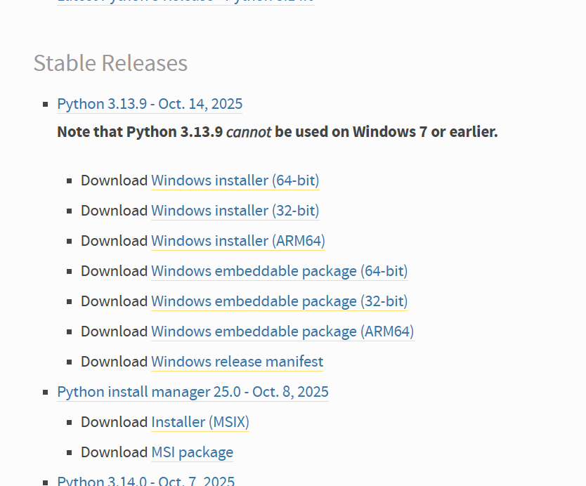
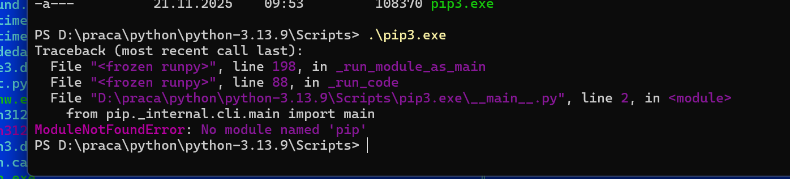
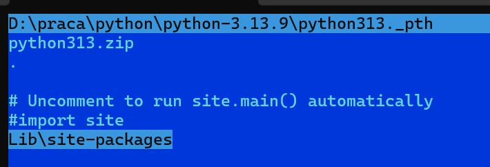

# INSRALLACJA PYTHONA

### stwórz folder DIR_PYTHON
np
``` BASH
mkdir D:\praca\python\python-3.13.9
``` 

### pobrać pythona

wybrać -> https://www.python.org/downloads/windows/

wybrać -> https://www.python.org/ftp/python/3.13.9/python-3.13.9-embed-amd64.zip
pobrać i rozpakować w folderze DIR_PYTHON



### instalacja PIP 

https://bootstrap.pypa.io tu jest opis co i jak zrobić

pobranie pliku https://bootstrap.pypa.io/get-pip.py 
wejdź do przeglądarki i zapisz w folderze DIR_PYTHON get-pip.py 

``` BASH
cd D:\praca\python\python-3.13.9
python get-pip.py
``` 

### gdy wyskoczy błąd po wpisaniu pip.exe
```
Traceback (most recent call last):
  File "<frozen runpy>", line 198, in _run_module_as_main
  File "<frozen runpy>", line 88, in _run_code
  File "D:\praca\python\python3\Scripts\pip.exe\__main__.py", line 2, in <module>
    from pip._internal.cli.main import main
ModuleNotFoundError: No module named 'pip'
```



w pliku sprawdzić  python313._pth czy jest 
należy dodać 

``` BASH
Lib\site-packages
``` 



### gdy wystąpi błąd 
```
błąd
~ play! 1.7.1, https://www.playframework.com  
~ framework ID is test


No module named 'win32pdh'
Traceback (most recent call last):  
File "D:\praca\play\play-1.7.1\framework\pym\play\cmdloader.py", line 26, in load_core
 mod = load_python_module(name, self.path)      
File "D:\praca\play\play-1.7.1\framework\pym\play\cmdloader.py", line 62, in load_python_module
 return imp.load_module(name, mod_desc[0], mod_desc[1], mod_desc[2]) 
File "C:\Program Files\WindowsApps\PythonSoftwareFoundation.Python.3.10_3.10.2032.0_x64__qbz5n2kfra8p0\lib\imp.py", line 172, in load_source
 module = _load(spec)     
File "<frozen importlib._bootstrap>", line 719, in _load
File "<frozen importlib._bootstrap>", line 688, in _load_unlocked
File "<frozen importlib._bootstrap_external>", line 883, in exec_module
File "<frozen importlib._bootstrap>", line 241, in _call_with_frames_removed

File "D:\praca\play\play-1.7.1\framework\pym\play\commands\daemon.py", line 14, in <module> 
import win32pdh, win32pdhutil
ModuleNotFoundError: No module named 'win32pdh'       
```
należy wykonać
```
pip install pywin32
```
